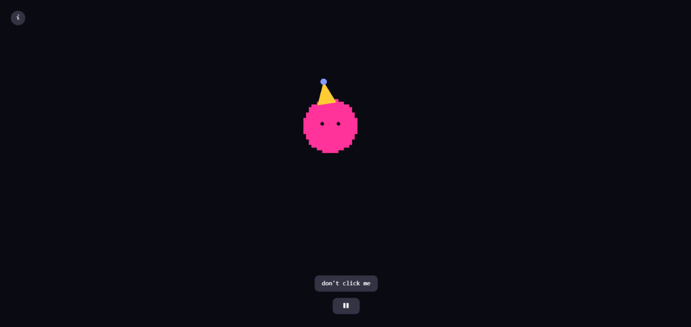

# Blobtag

A tiny reactive blob creature built with PixiJS. No HTML tags used. Built for Hack Club's Tagless.

**[Try it live →](https://blobtag.pages.dev/)**

## what is this

Blobtag is a small pixel creature with moods, and movements. It gets excited when your cursor is close, gets sleepy and droopy if it's left alone too long, and quietly breathes when nothing's happening. There's no AI or model behind any of it , just timers, some easing math, and a small state machine. Stacked together, it gives a pink blob personality.

It's rendered as blocky pixel art instead of a smooth shape, leaves a trail of sand-like particles as it moves, and hums along to its own procedurally (a hard word, googled it) generated lofi track. Stick around and poke at it a bit , there might be a couple of things hidden in here worth finding.

## features

- mood-reactive color - shifts warmer the closer your mouse gets, dims and goes cold when it's been alone too long
- pixel-art body - rendered on a grid instead of a smooth circle
- breathing - a subtle idle pulse so it never looks frozen
- blinking - randomized timing so it doesn't feel robotic
- directional squash & stretch - stretches in whatever direction it's actually moving
- sleepy mode - droopy eyes + a little cascading z z z  if you leave it alone too long
- sand trail - tiny particles kick up and drift down as it moves
- a fully generative lofi soundtrack - no audio files, every note is synthesized live with the Web Audio API, and the tempo/filter shift based on the blob's current mood
- a party hat that comes out when the music's playing, because why not
- a couple of hidden things i'm leaving for you to find

## the constraint

Tagless only allows `<html>`, `<head>`, `<body>`, `<meta>`, `<title>`, `<script>`, `<style>`, and `<canvas>` as literal tags — everything else has to be built without writing HTML markup directly. So the canvas is mounted via `document.body.appendChild()`, the favicon is injected with `document.createElement('link')`, and every button/panel/piece of UI you see is a PixiJS object built and drawn through JS, which took some getting used to.
## built with

- [PixiJS](https://pixijs.com/) for rendering
- the Web Audio API for the music (i made no audio files. Every note is generated in real time)
- vanilla Javascript

## running it locally

Clone the repo and just open `index.html` in a browser.
## a small note

My local Hackatime project is tracked as tagless, not blobtag. I originally built this under the tagless folder name, and when I renamed the local folder to blobtag, Hackatime treated it as a brand-new project instead of renaming the existing one, so my logged hours are still under tagless.

## made by

Ritam Misra for [Hack Club's Tagless](https://tagless.hackclub.com/)
